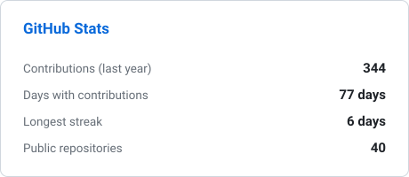
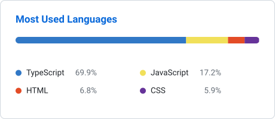

## Hello, Matheus Borges here! 👋

### Front-end developer — React, Next.js & TypeScript.

I build interfaces that are fast, accessible and pleasant to use. Lately I've been going one layer deeper, designing and building the APIs behind my own products to understand the whole picture — the front-end is still where I'm strongest.

🔭 Currently building **[Dondolio](https://dondolio.com)** — a scheduling platform for local businesses.

---

### 🛠️ Tech Stack

**Front-end**

**Back-end & Data**

**Testing & Tooling**

---

### 🚀 Featured Projects

| Project | What it is | Stack |
| :--- | :--- | :--- |
| **[Dondolio](https://dondolio.com)** 🌐 | Scheduling platform for local businesses — customers find a business and book in a few taps, no account required. | Next.js · NestJS · Prisma · PostgreSQL |
| **[Shortfy](https://github.com/MatheusBorgesDev/shortfy)** | Full-stack URL shortener with JWT auth, click tracking and a stats dashboard. | Next.js 15 · React 19 · Prisma · Vitest |
| **[ArenaSync](https://github.com/MatheusBorgesDev/arena-sync)** | Court booking app with separate admin and customer areas, documented with an ADR for every architectural decision. | Next.js 16 · React 19 · TanStack Query · Zustand |

---

### 📊 GitHub Stats

<picture>
  <source media="(prefers-color-scheme: dark)" srcset="assets/stats-dark.svg">
  
</picture>
<picture>
  <source media="(prefers-color-scheme: dark)" srcset="assets/languages-dark.svg">
  
</picture>

Cards are generated by a <a href=".github/workflows/stats.yml">GitHub Action</a> that runs daily and commits the SVGs to this repo — no third-party service involved.

---

### 📫 Contact me

